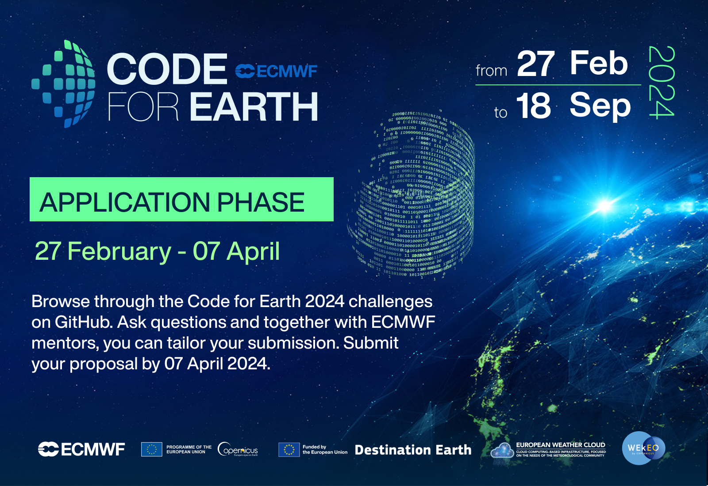

# ECMWF Code for Earth 2024

**ECMWF Code for Earth is an innovation programme run by the [European Centre for Medium-Range Weather Forecasts (ECMWF)](https://www.ecmwf.int/).** Its aim is to drive innovation and open source developments in the Earth sciences community - supporting developments in weather and climate, the two Copernicus services ([Copernicus Climate Change Service](https://climate.copernicus.eu/) and [Copernicus Atmosphere Monitoring Service](https://atmosphere.copernicus.eu/)) and [Destination Earth](https://www.ecmwf.int/destine).

Since 2018, each summer, developer teams work together with experienced mentors from ECMWF and partner organisations on innovative projects. These projects are related to the broad scope of activities at ECMWF, including data science, weather, climate or other earth sciences, visualisation and more.
     
 

</img>

Follow Code for Earth on [X (ex Twitter)](https://twitter.com/ECMWFCode4Earth) and sign up for our [newsletter](https://codeforearth.ecmwf.int/).

 

